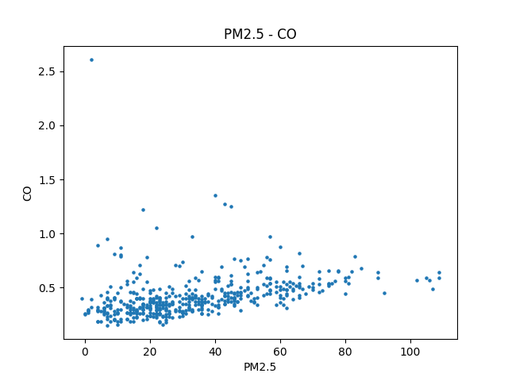
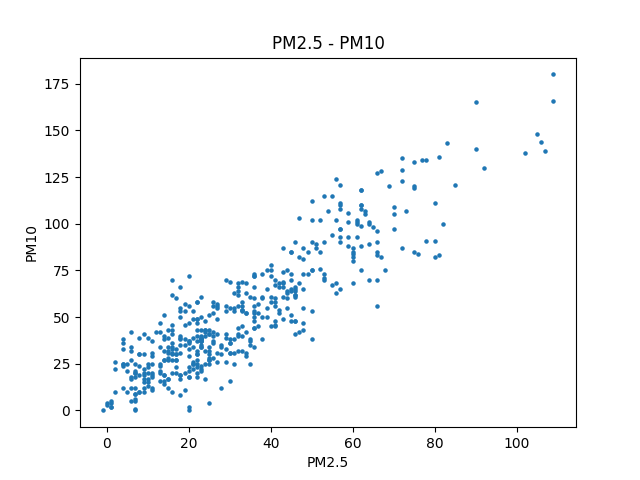
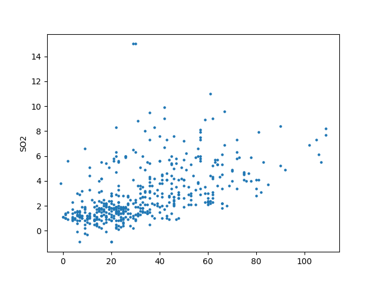

# HW1 Linear regression

Increasing predict accuracy by extract related features.

Run `plot.py` to plot other features versus PM2.5 data.
More related features:

index 2 : CO

index 8 : PM10

index 12: SO2

