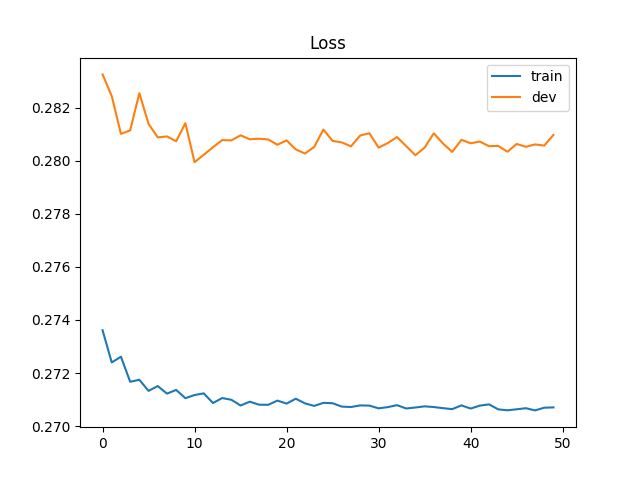
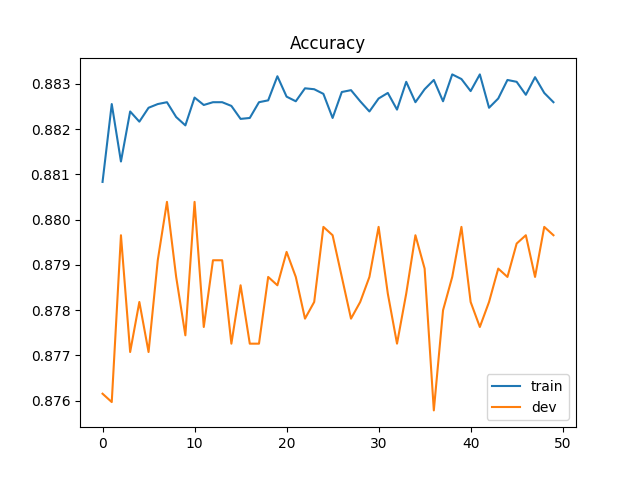

# HW2 Classification

Split data into small dataset, batch trainning.  

**Note:** Remember to save training data and normalized `test_X` for testing use.  

## Part 1 - Logistic regression
`train_lr.py`  
`test_lr.py`

Loss plot

Accuracy plot

Method to increase accuracy:
1. extract features by correlation coefficient.

## Part 2 - Porbabilistic generative model
`train_gn.py`  
`test_gn.py`  
